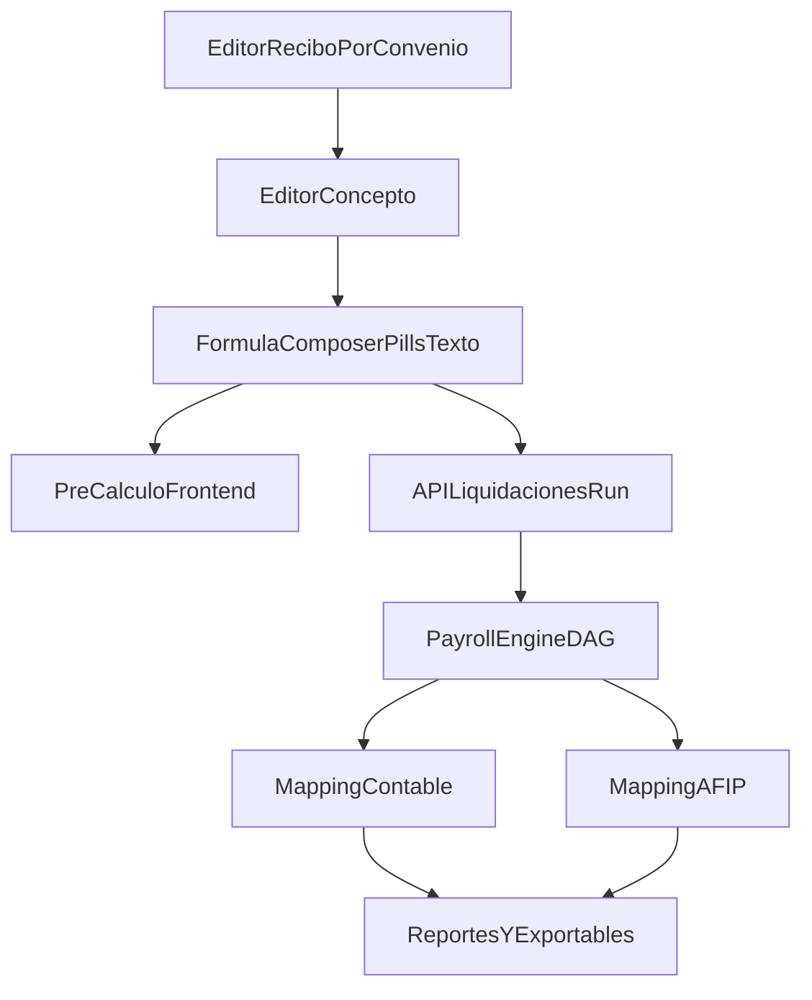

# Diseno MVP - Liquidacion de Sueldos (Argentina 2026)

## Objetivo

Construir un sistema fullstack extensible por convenio (inicialmente Luz y Fuerza / APUAYE) para modelar y ejecutar liquidaciones auditables, con formulas reutilizables, trazabilidad de calculo y salida contable/AFIP.

## Arquitectura adoptada

- Monorepo Node.js + TypeScript con workspaces npm.
- Frontend React + Vite en `apps/web`.
- Backend Fastify en `apps/api`.
- Dominio/motor en `packages/*`.
- Estrategia de datos:
  - test/integracion: in-memory,
  - produccion: SQL Server (base en `infra/sqlserver`).

## Estructura implementada

- `apps/api`
- `apps/web`
- `packages/shared-types`
- `packages/formula-engine`
- `packages/payroll-engine`
- `packages/tax-ar-2026`
- `packages/domain`
- `infra/sqlserver`

## Modelo funcional vigente

- `Concepto` con clase `definitivo | transitorio`.
- Los intermedios se modelan como **conceptos transitorios**.
- Un concepto puede participar en multiples recibos.
- Cada recibo mantiene su orden propio de conceptos definitivos.
- Cada concepto tiene identidad visual:
  - color (paleta de 30),
  - icono/forma (`circle`, `square`, `star`, extensible),
  - marcador discreto visible en listas y pills.
- Cada concepto tiene tags editables.

## Motor de formulas y DAG (implementado)

DSL/expresiones soportadas en MVP tecnico:

- `CONCEPTO(id)`
- `CCONCEPTO("codigo")`
- `SUM_TAG("tag")`
- `PARAM("nombre")`
- `TAG_OP("sum|avg|max|min","tag")`
- operadores matematicos texto (`+ - * / ( ) [ ] %`) escritos por usuario.

Capacidades:

- Extraccion automatica de dependencias.
- Orden topologico.
- Deteccion de ciclos.
- Ejecucion con traza basica por concepto.
- Agregacion por tags.
- Pre-calculo de prueba en frontend con valores mock.

## UI implementada: Modelo de liquidacion

### Layout general

- Sidebar + area central.
- Menu: `Dashboard`, `Modelo de liquidacion`, `Novedades`, `Contable / AFIP`.

### Editor de Recibo

- Selector de convenio.
- Selector de recibo filtrado por convenio.
- `+ Nuevo recibo`.
- `+ Agregar concepto definitivo` al recibo activo.
- Lista ordenable drag&drop de conceptos definitivos.
- Click directo en la fila de concepto para seleccionarlo/editarlo (sin boton `Editar formula`).
- Los conceptos definitivos del recibo tambien se pueden arrastrar al editor de formula.
- Corregido bug de convenio: al cambiar convenio se selecciona un recibo de ese convenio y no se pisa configuracion de otros.

### Editor de concepto

- Titulado como `Editor de concepto`.
- Subtitulo editable in-place por click con `codigo - descripcion (clase)`.
- Permite editar icono y color del concepto seleccionado.
- Selector de apariencia minimal en el encabezado (solo icono), con popover visual de forma y paleta default.
- El popover de apariencia cierra con click afuera.
- Gestion de tags:
  - tags como pills,
  - boton `-` dentro del pill para quitar,
  - alta de tag con input inline tipo pill y tecla Enter,
  - sugerencias por texto parcial (datalist) usando tags existentes.
- Editor de formula mixto:
  - pills semanticas (conceptos/funciones/parametros),
  - texto matematico editable **en el mismo lugar** entre pills,
  - inputs inline con ancho en `ch`,
  - sin autocomplete/sugerencias del navegador,
  - Enter inserta texto en posicion.

### Cajon lateral

- Conceptos transitorios drag&drop.
- `+ Nuevo transitorio`.
- Funciones y parametros drag&drop.
- Seccion `Tags` drag&drop/click.
- Al insertar un tag se abre modal con operaciones:
  - `Suma de...`
  - `Promedio de...`
  - `Maximo de...`
  - `Minimo de...`

## API MVP implementada

Endpoints:

- `GET /health`
- `GET /concepts`
- `POST /concepts`
- `POST /liquidaciones/run`

Estado:

- Persistencia actual in-memory.
- Ejecucion de liquidacion sobre motor actual.

## Modularizacion frontend aplicada

Para reducir acoplamiento de `App.tsx`, se separo en modulos:

- `apps/web/src/model/types.ts` (tipos de UI/modelo)
- `apps/web/src/model/constants.ts` (paletas, shapes, valores mock)
- `apps/web/src/model/helpers.ts` (token factory, preview eval, utilidades)
- `apps/web/src/model/seed.ts` (datos iniciales y templates)

`App.tsx` queda como compositor de estado + render principal.

## Estado por hitos

### Completado

1. Esqueleto monorepo y build transversal.
2. Modelo base definitivo/transitorio.
3. Motor base de formulas + DAG + ejecucion.
4. UI avanzada de modelado de recibos/conceptos/formulas con tags y editor visual-texto mixto.
5. Correccion de flujo por convenio y recibos.
6. Ajustes UX finos (apariencia compacta, click-outside, seleccion por click, tags inline).
7. Documentacion de diseno en raiz.

### En progreso / siguiente prioridad

1. Conectar UI con API real para guardar/leer entidades.
2. Persistencia ORM dual (test in-memory + prod SQL Server).
3. Mapeo contable por frente administrativo.
4. Salidas AFIP (F1359/SICOSS/LSD) versionables.
5. Ganancias 4ta 2026 exacto (normativa completa).
6. Tests unitarios/integracion/golden.

## Diagrama de flujo (objetivo operativo)

## Nota tecnica

`packages/tax-ar-2026` existe desacoplado pero mantiene tabla placeholder. Falta completar exactitud normativa 2026.
